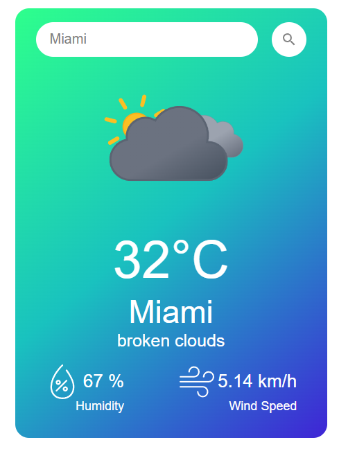

## 🌤 Weather App
Простое погодное приложение, показывающее текущие погодные условия для любого города.

## 💻 Использованные технологии

- **React** — для построения интерактивного пользовательского интерфейса
- **Vite** — для быстрой сборки и запуска локального сервера
- **JavaScript (JSX)** — для логики работы приложения
- **HTML5** — для структуры приложения
- **CSS3** — для стилизации элементов
- **OpenWeatherMap - Weather API** — для получения данных о погоде

## 🚀 Установка и запуск

1. Склонировать репозиторий:

`git clone https://github.com/Rozerik/Calculator`

`cd weather-app`

2. Установить зависимости:

`npm install`

3. Создать .env файл в корне проекта:
   
`VITE_API_KEY=ваш_ключ_здесь`

*(Получить ключ можно на сайте weatherapi.com)*

4. Запустить локальный сервер:

`npm run dev`

## 🖼 Скриншот приложения

## 📝 Что умеет приложение

- Ищет погоду по названию города

- Показывает температуру, состояние погоды, скорость ветра, влажность.

## 🧪 Пример использования

При вводе названия города в поисковом поле, можно получить следующую информацию о текущей погоде:

- Температура

- Скорость ветра

- Влажность

- Иконка погоды

## 📎 Дополнительные файлы

.env.example — пример файла с переменными окружения

## 🙏 Благодарности

Спасибо WeatherAPI за предоставление бесплатного API для работы с погодными данными.

## 📌 Автор

Илья Атрохин

GitHub: https://github.com/Rozerik
